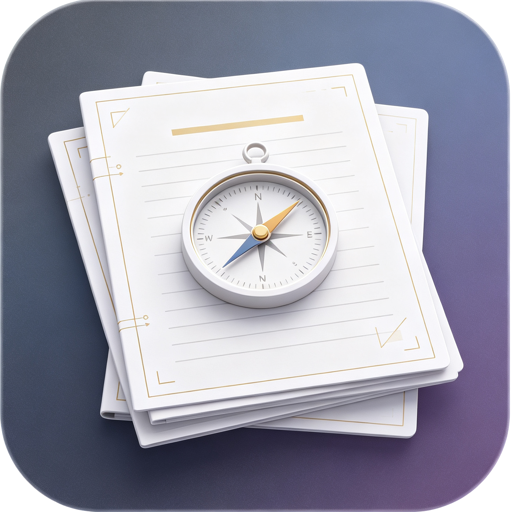

# PaperPrism

PaperPrism 是一款面向 macOS 的本地论文精读与科研学习工具。它将 PDF、Word 阅读、分段英译中、解释、核心观点笔记、专业词库和引用信息整理放在同一个清爽的桌面界面中。



## 功能

- 导入和分类管理本地 PDF、DOC 与 DOCX 论文
- 在原文中选择段落，生成翻译、语境解释和核心观点
- 把术语保存到专业词库并累计词频和来源论文
- 智能提取作者、年份、期刊、DOI、标签与 APA 引用草稿
- Word 阅读字体缩放，并在放大后按视窗宽度自动换行
- 删除失效或不再需要的论文记录，不删除原始论文文件
- 浅色、低干扰的原生 macOS 阅读界面

## 隐私与 Agent

本仓库不捆绑任何模型、Agent 可执行程序、API Key 或服务商配置。PaperPrism 提供一个中立的命令行接口，你可以接入自己日常使用的 Agent 工具或编写一个很薄的兼容适配脚本。

PaperPrism 只在你主动点击分析或识别时启动已配置的工具：任务通过标准输入传入，JSON 结果从标准输出读取，日志走标准错误。身份验证、模型选择、联网行为和数据去向均由该外部工具决定。请在使用前阅读对应工具的隐私政策。

完整协议与 JSON 结构见 [Agent 接入文档](docs/AGENT_INTEGRATION.md)。

## 系统要求

- macOS 13 Ventura 或更高版本
- Swift 5.10 或兼容的 Xcode Command Line Tools
- 可选：一个支持标准输入/输出协议的命令行 Agent

## 构建与运行

```bash
git clone https://github.com/moistrain/PaperPrism.git
cd PaperPrism
./scripts/run-app.sh
```

也可以仅编译 Swift Package：

```bash
swift build
```

首次运行后，在 macOS 菜单中打开 `PaperPrism → 设置`，选择外部 Agent 可执行文件，并按需逐行填写启动参数。

公开版使用独立的 Bundle ID，并把资料库存入：

```text
~/Library/Application Support/PaperPrismCommunity/library.json
```

也可通过 `PAPERPRISM_DATA_DIRECTORY` 环境变量指定用于开发测试的数据目录。

## 开发

欢迎提交 Issue 和 Pull Request。开始贡献前请阅读 [CONTRIBUTING.md](CONTRIBUTING.md)。请勿在 Issue、日志或提交中附带论文原文、API Key、访问令牌或私有 Agent 二进制文件。

开发者：LiRunxiang<br>
邮箱：[moistrain.lee@gmail.com](mailto:moistrain.lee@gmail.com)

本项目以公益和科研学习为初衷。

## 双重许可

你可以选择：

1. 按 [GNU Affero General Public License v3.0 or later](LICENSE) 使用、修改和分发本项目；该许可证允许包括商业用途在内的使用，但必须履行相应的开源义务。
2. 如需在闭源产品中集成、分发而不采用 AGPL，请联系开发者洽谈单独的商业许可，详见 [COMMERCIAL-LICENSE.md](COMMERCIAL-LICENSE.md)。

除非另有书面协议，贡献默认以 AGPL-3.0-or-later 提交。
